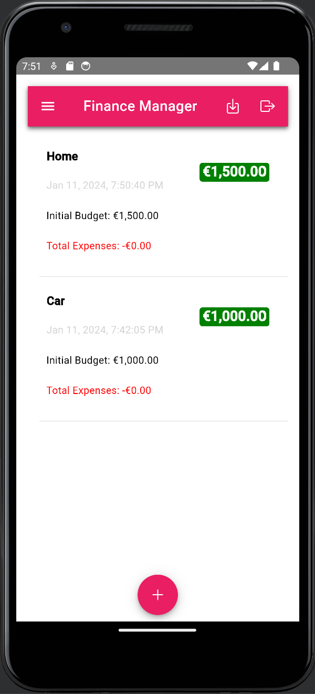

<div align="center">
    
</div>


# ADVANCED CROSS-PLATFORM APPLICATION DEVELOPMENT

**Title:** Budget Planner Application <br>
**Name:** Rodrigo Almeida <br> 
**Student ID:** G00377123

## Introduction

Budget Planner is a user-friendly application developed for financial management. Built using the latest Ionic framework with Angular, this app incorporates `Capacitor` for native device integration, allowing for functionalities like saving files directly on the device.
It also uses `Angular Material` for a refined user interface, `Chart.js` for dynamic financial data representation, and `jsPDF` and `html2canvas` for generating downloadable PDF reports. 


## Install the app on your `Android` by scanning the QR code below.

<div align="center">
    
</div>

## Key Components
<a href="https://atlantictu-my.sharepoint.com/:v:/g/personal/g00377123_atu_ie/EcshONzekjFEuAgy1mM4Oa4Bw3z8bxbtk8pBRDcxoGL2XQ?e=Uq2tVP&nav=eyJyZWZlcnJhbEluZm8iOnsicmVmZXJyYWxBcHAiOiJTdHJlYW1XZWJBcHAiLCJyZWZlcnJhbFZpZXciOiJTaGFyZURpYWxvZy1MaW5rIiwicmVmZXJyYWFBcHBQbGF0Zm9ybSI6IldlYiIsInJlZmVycmFsTW9kZSI6InZpZXcifX0%3D" target="_blank" style="background-color: #007bff; color: white; padding: 10px 20px; text-align: center; text-decoration: none; display: inline-block; border-radius: 5px;">Click here to view screencast</a>

## Services:
1. **AddBudgetService**: Manages budget-related operations.

    Methods:
    - `getBudgetById()`: Retrieves a budget by its ID.
    - `getCurrentBudget()`: Fetches the current budget for the authenticated user.
    - `createBudget()`: Creates a new budget.
    - `updateBudget()`: Updates a budget.
    - `deleteBudget()`: Deletes a budget.
    - `createExpense()`: Creates an expense for a specific budget.
    - `updateExpense()`: Updates an expense for a specific budget.
    - `updateRemainingAmount()`: Updates the remaining amount of a budget.

2. **AuthService**: Handles user authentication and profile management.

    Methods:
    - `register()`: Registers a new user.
    - `login()`: Logs in a user.
    - `logout()`: Logs out the current user.
    - `resetPw()`: Sends a password reset email.

3. **ChartService**: Manages chart creation and rendering using Chart.js.

    Methods:
    - `fetchData()`: Retrieves chart data.
    - `generateChart()`: Generates a new chart.
    - `renderDoughnutChart()`: Renders a doughnut chart.
    - `renderBarChart()`: Renders a bar chart.

4. **ExpenseUpdateService**: Provides a mechanism to notify components about expense updates.

    Methods:
    - `notifyExpenseAdded()`: Notifies that a new expense has been added.

5. **ExportDataService**: Handles exporting data to PDF using jsPDF and html2canvas.

    Methods:
    - `exportToPDF()`: Exports content to a PDF file.
    - `savePDF()`: Saves the generated PDF to the device.

## Components:

1. **LoginPage**: Manages user login and registration.

    Methods:
    - `register()`: Registers a new user.
    - `login()`: Authenticates a user.
    - `sendReset()`: Sends a password reset email.

<div align="center">
    
</div>


2. **HomePage**: The main dashboard shows an overview of budgets. User authentication, form handling, alerts for feedback.

    Methods:
    - `getBadgeColor(remainingAmount: number | undefined)`: Returns the badge color based on the remaining amount.
    - `getFontColor(remainingAmount: number | undefined)`: Returns the font color based on the remaining amount
    - `loadBudgets()`: Loads all budgets for the current user.
    - `deleteBudget()`: Deletes a budget.
    - `editBudget()`: Opens the modal to edit a budget.
    - `openUpdateInput()`: Opens the update input alert for a budget.

<div align="center">
    
</div>


3. **AddBudgetPage** ***(STANDALONE)***: Allows users to add a new budget.

    Methods:
    - `addBudget()`: Adds a new budget.
    - `closeModal()`: Closes the modal.

<div align="center">
    
    
</div>

4. **Add-expense-modal**: This class is used to manage the add-expense modal page. It injects `{ ModalController } from '@ionic/angular'`. Expense category selection, form submission for expense addition.

    Methods:
    - `addExpense()`: Method to add an expense.
    - `closeModal()`: Method to close the modal.

<div align="center">
    
</div>

5. **AddExpensePage**: This enables users to add expenses to a budget.
Expense addition, budget detail loading, doughnut chart rendering, alert and modal handling.

    Methods:
    - `loadBudgetDetails()`: Loads the details of a specific budget.
    - `deleteExpense()`: Deletes an expense.
    - `toggleDoughnutChart()`: Toggles the visibility of the doughnut chart.
    - `prepareDoughnutChartData()`: prepare the data for the doughnut chart.
    - `getIconForExpense()`: gets the icon based on the expense title.
    - `exportData()`: method to export the data

<div align="center">
    
</div>


6. **Download-Viewer-Modal**: This class displays downloadable content injecting `{ ModalController } from '@ionic/angular'`. Presents generated PDFs for download.

    Methods:
    - `closeModal()`: Method to close the modal.

<div align="center">
    
    
</div>

Click on the link below to access the pdf printed:

[Click here to view printed PDF](./src/assets/pdf/f45ca756-ef67-443c-8870-f4fbf2deb84e.pdf)

7. **InsightPage**: Provides insights and analytics of the user's budgets. Bar chart representation of budgets, data filtering and preparation.

    Methods:
    - `prepareBarChartData()`: Prepares data for the bar chart.

<div align="center">
    
</div>


## Application Flow
- **User Authentication**: Managed by the LoginPage.
- **Budget Management**: Users create and manage budgets via the HomePage and AddBudgetDetailsPage.
- **Expense Tracking**: Expenses are added and managed on the AddExpensePage.
- **Data Analysis and Reporting**: InsightsPage provides financial analytics using charts.
- **Data Export**: Users can export data to PDF using the ExportDataService.


 
## This repo can be cloned following the instructions below:

**Prerequisites:**

- **Node.js**: A JavaScript runtime built on Chrome's V8 JavaScript engine. Download Node.js
- **npm**: A package manager for JavaScript, included with Node.js.
- **Ionic CLI**: The command-line interface for Ionic. Install it globally using npm:

    ```
    npm install -g @ionic/cli
    ```
- **Angular CLI**: A command-line interface for Angular. Install it globally using npm:
    ```
    npm install -g @angular/cli
    ```
- **Angular Material**: UI component library for Angular. 
    ```
    ng add @angular/material
    ```
- **Chart.js**: Simple JavaScript charting.
    ```
    npm install chart.js
    ```
- **jsPDF**: Client-side JavaScript PDF generation. 
    ```
    npm install jspdf
    ```
- **html2canvas**: Screenshot captures with JavaScript. 
    ```
    npm install html2canvas
    ```


## Cloning the Repository
1. **Clone the Repository**: Use the git clone command to clone the repository:

    ```
    git clone git@github.com:rodAlm08/acpad_project.git
    ```
2. **Navigate to the Project Directory**:

    ```
    cd acpad_project
    ```

## Setting Up the Project
1. **Install Project Dependencies**: In the project directory, run:
    ```
    npm install
    ```
This command will install all necessary dependencies, including Angular Material, Chart.js, jsPDF, and html2canvas.

2. **Firebase Setup**:
- Ensure the Firebase CLI is installed. If not, install it globally using npm:

    ```
    npm install -g firebase-tools
    ```
- Log in to Firebase:
    ```
    firebase login
    ```
Follow the browser prompts to authenticate. This step is necessary for connecting to Firebase services like Firestore, and Authentication.

Configure Firebase in the Project:
- Make sure the Firebase configuration is properly set up in your project. This is typically found in the src/environments/environment.ts file for Angular projects. You should have something like:
    ```
    export const environment = {
    production: false,
    firebaseConfig: {
        apiKey: "your-api-key",
        authDomain: "your-project-auth-domain",
        projectId: "your-project-id",
        storageBucket: "your-project-storage-bucket",
        messagingSenderId: "your-messaging-sender-id",
        appId: "your-app-id",
        measurementId: "your-measurement-id"
    }
    };
    ```
Replace the placeholders with your actual Firebase project settings.

3. **Serve the Application Locally**: To view and test the app:

    ```
    ionic serve
    ```
The application should now be accessible at `http://localhost:8100`

# Roadblocks and Unfinished Functionality
While developing the Budget Planner Application, several challenges were encountered, and some functionalities remained incomplete.

## Roadblocks
1. **Firebase integration Complexity**: Integrating Firebase with Angular posed challenges, especially when handling real-time data updates.
2. **Chart rendering issues**: Encountered difficulties with dynamically updating Chart.js visualizations, especially when choosing between different types of charts.
3. **Appflow**: Issues with build configurations, and problems encountered during the build process in Appflow. Due to limited free credit, it was challenging.
4. **App Store deployment**: Deployment to the Google App Store faced a significant delay due to the identity verification process. The requirement to submit a passport copy and proof of address, and the lead time for verification, prevented the deployment of the app to the Google App Store.
<div align="center">
    
</div>


## Unfinished Functionality
1. **Budget Forecasting**: Future enhancements could include predictive analytics for budget planning.
2. **Notifications and Alerts**: Planned functionality for notifications about budget limits and expense tracking has not been implemented.
3. **Multi-Currency Support**: The application currently supports a single currency (€), with plans to include multi-currency functionalities that are yet to be realized.
4. **Accessibility Features**: Improvements in accessibility features for users with disabilities have not been fully addressed.

## Resources

* [YouTube](https://www.youtube.com/watch?v=sE08f4iuOhA) - Chart.js tutorial
* [YouTube](https://www.youtube.com/watch?v=U7RvTTF9dnk) - Building an Ionic App with Firebase Authentication
* [YouTube](https://www.youtube.com/watch?v=mlGehHg4oSA) - How to Create PDF Files with Ionic using PDFMake
* [YouTube](https://www.youtube.com/watch?v=QZ-CRdhxQbI) - Create PDF Files with Ionic and Capacitor using PDFMake
* [Angular Material](https://material.angular.io/) - Material Design components for Angular
* [YouTube](https://www.youtube.com/watch?v=S9XBYOCcOdA) -  Tutorial to Export HTML With Custom CSS Styles to PDF Document in Javascript
  

***
## End

[](https://classroom.github.com/open-in-codespaces?assignment_repo_id=12985430)


